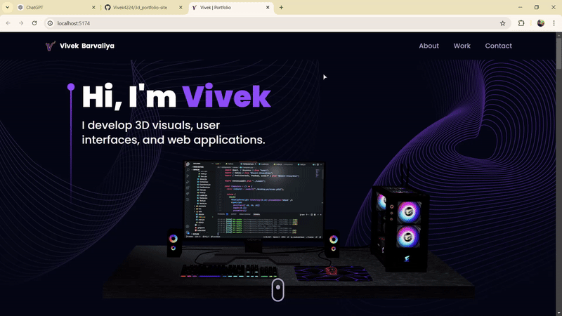

# Portfolio Site for Vivek Barvaliya

Welcome to the portfolio website of **Vivek Barvaliya**, a web developer. This site is built using **React** and **Bootstrap** to showcase projects, skills, and achievements.

## Technologies Used

- **React**: A JavaScript library for building user interfaces, used to create dynamic components and manage the application's state.
- **Bootstrap**: A popular CSS framework for creating responsive and mobile-first websites.
- **Vite**: A fast build tool and development server, optimized for modern web applications.

## Features

- **Responsive Design**: The site is designed to be mobile-first, ensuring a seamless experience on all devices.
- **Smooth Transitions**: Built using React to handle dynamic content with smooth transitions.
- **Project Showcase**: Displays various projects with details like descriptions, technologies used, and links to GitHub repositories or live demos.

## Demo

Here’s a preview of the portfolio website:



## Installation

To run this project locally, follow these steps:

1. **Clone the repository**:

   ```bash
   git clone https://github.com/Vivek4224/2_3D_PORTFOLIO.git
   ```
